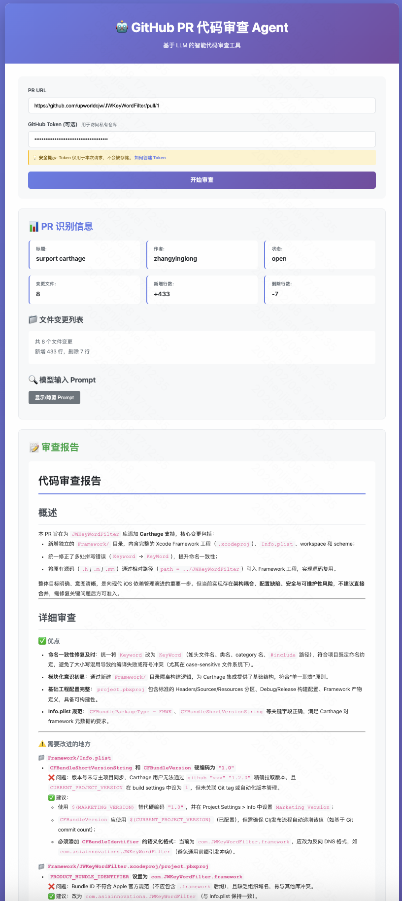

# 🤖 Code Review Agent (GitHub PR)

<div align="center">

一个用于 **GitHub Pull Request** 的智能代码审查 Agent：输入 PR 链接，自动拉取变更文件与 patch/diff，调用 LLM 生成专业的审查报告（Markdown）。

[](https://code-review-agent-delta.vercel.app)
[](https://vercel.com/new/clone?repository-url=https://github.com/upworldcjw/code-review-agent)

**🎯 [在线体验](https://code-review-agent-delta.vercel.app) | 📖 [部署指南](./DEPLOYMENT.md)**

</div>

---

## 🎬 快速演示

### 📸 界面预览

<div align="center">
  
</div>

### 💡 功能预览

<table>
<tr>
<td width="50%">

**1️⃣ 输入 PR URL**
- 默认已填充示例 PR
- 可选填写 GitHub Token
- 点击"开始审查"

</td>
<td width="50%">

**2️⃣ 查看审查报告**
- PR 基本信息展示
- 文件变更统计
- LLM 生成的审查报告

</td>
</tr>
</table>

### 在线体验（无需安装）

访问 **[https://code-review-agent-delta.vercel.app](https://code-review-agent-delta.vercel.app)**，立即体验：

1. ✨ **默认 PR 已填充** - 点击"开始审查"即可测试
2. 🔐 **支持自定义 Token** - 可选填写 GitHub Token 访问私有仓库
3. 📊 **可视化展示** - PR 信息、Prompt、审查报告一目了然
4. ⏱️ **3 分钟超时** - 支持大型 PR 的深度分析

---

## ✨ 功能特性

- 🖥️ **Web 界面**：现代化 UI，可视化展示 PR 信息和审查报告
- 🔐 **自定义 Token**：支持用户提供 GitHub Token 访问私有仓库
- 💻 **CLI 工具**：`review <prUrl>` 生成 `report.md`
- 🌐 **HTTP API**：`POST /review` 传 PR 链接，返回 Markdown 报告
- 🔗 **GitHub 集成**：自动拉取 PR files/patch 和完整 diff
- 🧠 **LLM 驱动**：支持 OpenAI / 通义千问等多种 LLM
- 📊 **Prompt 预览**：可视化展示发送给模型的完整输入
- ⚡ **Serverless 部署**：支持 Vercel 一键部署，零配置

## PR 链接格式

- `https://github.com/<owner>/<repo>/pull/<number>`

> 你给的 `https://github.com/upworldcjw` 是个人主页，不是 PR 链接；需要具体 PR 链接才能审查。

## 环境变量

复制 `.env.example` 为 `.env`：

```bash
cp .env.example .env
```

- `OPENAI_API_KEY`：必需
- `GITHUB_TOKEN`：建议（私有仓库必需；公开仓库也建议配置，避免限流）
- `PORT`：HTTP服务端口，默认 `8787`

## 🚀 快速开始

### 1. 安装依赖

```bash
npm install
```

### 2. 配置环境变量

```bash
cp .env.example .env
# 编辑 .env 文件，填入你的 API Keys
```

### 3. 启动服务

```bash
npm start
# 访问 http://localhost:8787
```

## 💻 CLI 使用

```bash
node src/cli.js review https://github.com/{owner}/{repo}/pull/{number} --out report.md
```

**常用参数：**
- `--out <file>` 输出文件（默认 `report.md`）
- `--json` 同时输出JSON到stdout（便于接入流水线）

## 🌐 HTTP API 使用

### 启动服务器
```bash
npm start
# 默认 http://localhost:8787
```

### 调用 API
```bash
curl -X POST http://localhost:8787/review \
  -H 'Content-Type: application/json' \
  -d '{"url":"https://github.com/{owner}/{repo}/pull/{number}"}'
```

### 健康检查
```bash
curl http://localhost:8787/health
```

## 🖥️ Web 界面使用

1. 启动服务：`npm start`
2. 访问：http://localhost:8787
3. 输入 PR URL，点击"开始审查"
4. 查看识别信息和审查报告
5. 可展开查看发送给模型的 Prompt

## 🐳 Docker 部署

```bash
# 构建镜像
docker build -t code-review-agent .

# 运行容器
docker run -d -p 8787:8787 \
  -e OPENAI_API_KEY=your-api-key \
  -e OPENAI_BASE_URL=https://dashscope.aliyuncs.com/compatible-mode/v1 \
  -e GITHUB_TOKEN=your-github-token \
  --name code-review-agent \
  code-review-agent

# 或使用 Docker Compose
docker-compose up -d
```

## 🌍 远程部署

### 🚀 一键部署到 Vercel（推荐）

[](https://vercel.com/new/clone?repository-url=https://github.com/upworldcjw/code-review-agent)

**在线演示**: [https://code-review-agent-delta.vercel.app](https://code-review-agent-delta.vercel.app)

#### 环境变量配置

部署后需要在 Vercel Dashboard 配置以下环境变量：

| 变量名 | 说明 | 必需 |
|--------|------|------|
| `OPENAI_API_KEY` | LLM API Key（支持通义千问） | ✅ |
| `OPENAI_BASE_URL` | API Base URL（通义千问需要） | 推荐 |
| `GITHUB_TOKEN` | GitHub Personal Access Token | 可选 |

**通义千问配置示例**：
```env
OPENAI_API_KEY=sk-xxx
OPENAI_BASE_URL=https://dashscope.aliyuncs.com/compatible-mode/v1
```

---

### 📦 CLI 部署

```bash
# 安装 Vercel CLI
npm install -g vercel

# 登录并部署
vercel login
vercel --prod

# 配置环境变量
vercel env add OPENAI_API_KEY
vercel env add OPENAI_BASE_URL
vercel env add GITHUB_TOKEN
```

---

### 🌐 其他部署平台

详细部署指南请查看 [DEPLOYMENT.md](./DEPLOYMENT.md)

支持的部署平台：
- ✅ **Vercel** (推荐 - 免费、零配置、Serverless)
- ✅ **Railway** (简单部署、免费额度)
- ✅ **Docker + 云服务器** (完全控制)
- ✅ 阿里云 / 腾讯云 / AWS 等

## 📚 通义千问配置

使用阿里云通义千问：

1. 访问百炼平台：https://bailian.console.aliyun.com
2. 获取 API Key
3. 配置环境变量：

```env
OPENAI_API_KEY=sk-xxx
OPENAI_BASE_URL=https://dashscope.aliyuncs.com/compatible-mode/v1
```

## 📖 更多文档

- [🎬 演示指南](./docs/DEMO.md) - 详细的使用演示和录制教程
- [🚀 部署指南](./DEPLOYMENT.md) - 详细的远程部署教程
- [📚 API 文档](./src/server.js) - HTTP API 接口说明
- [⚙️ 环境变量配置](./.env.example) - 所有可配置项

---

## 🌟 Star History

如果这个项目对你有帮助，请给个 ⭐️ Star 支持一下！

[](https://github.com/upworldcjw/code-review-agent)

---

## 📄 License

ISC License

---

<div align="center">

**Made with ❤️ by [chenjianwei](https://github.com/upworldcjw)**

[⬆ 回到顶部](#-code-review-agent-github-pr)

</div>
